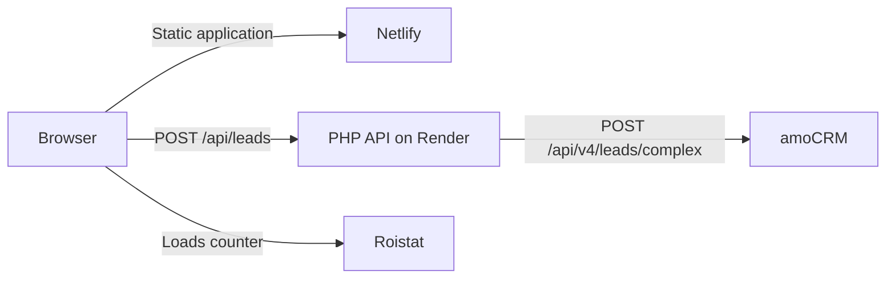

# Lead Capture Integration — amoCRM + Roistat

A production-ready lead form that sends validated customer data to amoCRM, creates a contact with a linked deal, and enriches the deal with Roistat attribution and a time-on-site flag.

## Live demo

- **Frontend:** [site-amo-int.netlify.app](https://site-amo-int.netlify.app/)
- **Backend health check:** [site-amo-api.onrender.com/health](https://site-amo-api.onrender.com/health)

> The backend runs on Render's Free instance type. After 15 minutes without inbound traffic, the service spins down. The first request after that can take about a minute while the service starts again.

## What the project demonstrates

- responsive, accessible lead form built with semantic HTML, CSS, and vanilla JavaScript;
- client-side and server-side validation;
- PHP 8.5 REST API with structured JSON responses and CORS protection;
- contact and linked-deal creation through the amoCRM API;
- Roistat visit attribution with a `nocookie` fallback;
- tracking whether the form was submitted after more than 30 seconds on the page;
- Docker-based backend runtime;
- automatic deployment from the `main` branch to Netlify and Render;
- feature-branch and pull-request workflow with focused commits.

## Architecture



The browser reads the `roistat_visit` cookie created by the Roistat counter and sends its value to the API as `roistatVisit`. This is necessary because Netlify and Render use different domains, so the browser does not automatically send the frontend cookie to the backend.

## Data flow

When the form is submitted:

1. The frontend validates the input and sends JSON to `POST /api/leads`.
2. The PHP API repeats validation and normalizes the values.
3. The API creates a contact and a linked deal in one amoCRM request.
4. The frontend displays a success or error state.

| Form data | amoCRM destination |
|---|---|
| Name | Contact name |
| Phone | Contact `PHONE` field |
| Email | Contact `EMAIL` field |
| Budget | Deal price |
| Roistat visit ID | Deal custom field `978093` |
| More than 30 seconds on site | Deal custom field `978095` |

If the `roistat_visit` cookie is unavailable, the frontend sends `nocookie`. The time-on-site value is always sent as a boolean.

## Technology stack

| Layer | Technology |
|---|---|
| Frontend | HTML5, CSS3, vanilla JavaScript |
| Backend | PHP 8.5, cURL, mbstring |
| CRM and analytics | amoCRM API v4, Roistat counter |
| Runtime | Docker, Alpine Linux |
| Hosting | Netlify, Render |
| Delivery | GitHub, feature branches, pull requests, automatic deploys |

## Project structure

```text
.
├── frontend/
│   ├── index.html          # Form and Roistat counter
│   ├── styles.css          # Responsive interface
│   ├── config.js           # Backend endpoint
│   └── app.js              # Validation, tracking, and form submission
├── backend/
│   ├── public/index.php    # API entry point and routes
│   ├── src/                # Validation, HTTP, domain, and amoCRM layers
│   ├── tests/              # Dependency-free PHP tests
│   ├── .env.example        # Environment variable template
│   ├── Dockerfile          # Production runtime
│   └── router.php          # PHP development server router
└── render.yaml             # Render Blueprint
```

## API

### `POST /api/leads`

Example request:

```json
{
  "name": "Alex",
  "email": "alex@example.com",
  "phone": "79990000000",
  "price": "2500",
  "roistatVisit": "123456",
  "timeOnSiteOver30": true
}
```

Successful amoCRM response:

```json
{
  "success": true,
  "message": "Lead created successfully.",
  "data": {
    "leadId": 12345678
  }
}
```

Validation errors return HTTP `422`. amoCRM integration failures return HTTP `502` without exposing credentials or upstream response details.

### `GET /health`

```json
{
  "success": true,
  "status": "ok"
}
```

Only `/health` and `/api/leads` are implemented. Therefore, opening the backend root URL returns a JSON `404 Endpoint not found` response by design.

## Local development

### Backend with Docker

Build the image:

```bash
docker build -t site-amo-backend ./backend
```

Run in validation-only mode, without creating records in amoCRM:

```bash
docker run --rm -p 8080:8080 \
  -e ALLOWED_ORIGIN=http://127.0.0.1:4173 \
  site-amo-backend
```

The local endpoints are then available at:

```text
POST http://127.0.0.1:8080/api/leads
GET  http://127.0.0.1:8080/health
```

### Backend with amoCRM enabled

Create `backend/.env` from `backend/.env.example` and replace all placeholders:

```dotenv
ALLOWED_ORIGIN=http://127.0.0.1:4173
AMOCRM_BASE_URL=https://your-account.amocrm.ru
AMOCRM_ACCESS_TOKEN=your_long_lived_token
```

Then run:

```bash
docker run --rm -p 8080:8080 --env-file backend/.env site-amo-backend
```

`backend/.env` is ignored by Git and must never be committed.

### Frontend

For local development, temporarily set the endpoint in `frontend/config.js` to:

```js
apiUrl: "http://127.0.0.1:8080/api/leads"
```

Then serve the directory with any static server, for example:

```bash
python -m http.server 4173 --directory frontend
```

Open [http://127.0.0.1:4173](http://127.0.0.1:4173). Do not commit the temporary local endpoint.

## Tests

The backend tests do not require Composer or third-party test frameworks:

```bash
docker run --rm site-amo-backend php tests/LeadRequestValidatorTest.php
docker run --rm site-amo-backend php tests/AmoCrmPayloadFactoryTest.php
docker run --rm site-amo-backend php tests/AmoCrmClientTest.php
```

The final production smoke test covers:

- responsive desktop and mobile layouts;
- frontend input filtering and validation;
- backend health response;
- contact and linked-deal creation in amoCRM;
- real `roistat_visit` transfer;
- `nocookie` fallback transfer.

## Deployment

### Netlify

- Repository branch: `main`
- Build command: empty
- Publish directory: `frontend`

Netlify publishes the static frontend automatically after changes reach `main`.

### Render

The root `render.yaml` creates the Docker web service from `backend/Dockerfile`. Configure these values in **Render → Service → Environment**:

```dotenv
ALLOWED_ORIGIN=https://your-netlify-site.netlify.app
AMOCRM_BASE_URL=https://your-account.amocrm.ru
AMOCRM_ACCESS_TOKEN=your_long_lived_token
```

Important details:

- `ALLOWED_ORIGIN` must be the exact frontend origin, without a trailing slash or path;
- `PORT` is provided by Render automatically and must not be added manually;
- commits merged into `main` trigger automatic deployment;
- Free web services spin down after 15 minutes without inbound traffic;
- the first request after a spin-down can take about a minute;
- the local filesystem is ephemeral and must not be used for persistent data;
- use `/health`, not the root URL, to check the API status.

See the official [Render Free instance documentation](https://render.com/docs/free) for current platform limits.

## Security notes

- The amoCRM access token exists only in local or hosting environment variables.
- `.env` files are excluded from Git; only `.env.example` is tracked.
- The frontend contains no API credentials.
- CORS allows requests only from the configured frontend origin.
- Validation is repeated on the backend because browser-side checks are not a security boundary.
- Internal exceptions and amoCRM response details are not returned to clients.

## Git workflow

Development was organized through short-lived feature branches and reviewed pull requests. Completed branches were merged into `main` with merge commits and then removed locally and remotely, preserving a readable history of the frontend, PHP API, amoCRM, deployment, and Roistat stages.
